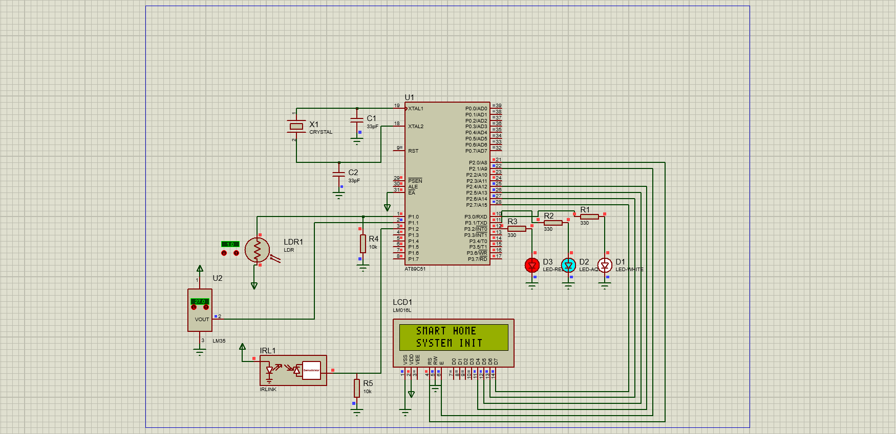
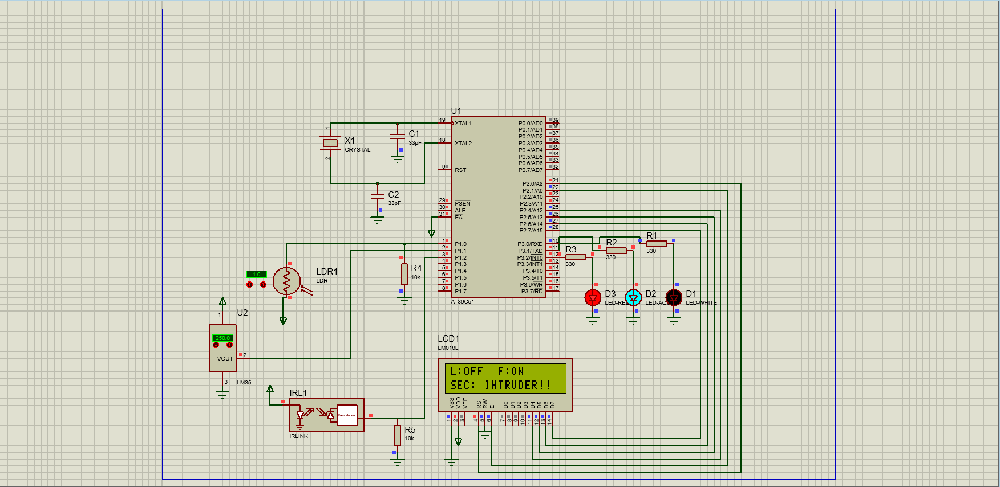

**📟 Smart Home Automation and Security System (8051)**

**🔹 Overview**

This project demonstrates a multi-sensor smart home automation and security system using the AT89C51 microcontroller. It handles environmental inputs (LDR, LM35) and perimeter security monitoring (IR Sensor) in real time, controlling automated appliances (Light, Fan) and alarm systems while outputting status reports on a 16x2 LCD operating in 4-bit mode.

**🎯 Objective**

To process real-time sensor data using the AT89C51 microcontroller and display status reports on an LCD while minimizing GPIO pins through efficient 4-bit interfacing.

**⚙️ Tech Stack**

-> Microcontroller: AT89C51 (8051 family)

-> IDE: Keil µVision

-> Simulator: Proteus Design Suite

-> Sensors: LDR (Light), LM35 (Temperature), IRLINK (Motion)

-> Display: 16x2 LCD (4-bit mode)

**🔌 Pin Configuration**

**Sensor Input Interface**

P1.0 (LDR Input) <- Connected with 10kΩ pull-down resistor network

P1.1 (LM35 Input) <- Connected to VOUT pin (Triggers High when threshold is crossed)

P1.2 (IR Sensor Input) <- Connected with 10kΩ pull-down resistor network

**Appliance Output Interface**

P3.0 (Room Light) -> White LED via 330Ω resistor

P3.1 (Exhaust Fan) -> Aqua LED via 330Ω resistor

P3.2 (Security Alarm) -> Red LED via 330Ω resistor

**LCD Interface (4-bit mode)**

RS -> P2.0

EN -> P2.1

D4-D7 -> P2.4 - P2.7

VSS -> GND

VDD -> +5V

**🧠 Working Principle**

-> Sensors constantly track home environment metrics (Light, Heat, Motion)

-> Microcontroller scans input pins via Port 1 register polling loops

-> LDR sets P1.0 low during darkness, triggering the White LED (P3.0) and "L:ON" status

-> LM35 tracks ambient heat; the fan control logic trips and switches P1.1 high when the temperature threshold is exceeded, activating the Aqua LED (P3.1) and "F:ON" status

-> IR sensor beam break pulls P1.2 high, instantly flashing "SEC: INTRUDER!!" and launching the Red Alarm LED (P3.2)

-> All updates are rendered dynamically on the LCD via the 4-bit data bus splitting engine

**🛠️ Simulation Flow**

-> Embedded C source code compiled in Keil µVision to generate the .hex file

-> .hex file loaded into the AT89C51 microcontroller inside Proteus

-> Operating clock frequency parameters configured to 11.0592 MHz

-> Dynamic component interactions updated using interactive on-screen adjustments

-> Simulation run to observe active automated responses on LCD and status LEDs

**📊 Result**

-> Automated home appliance management successfully implemented

-> Fan automatically triggers ON when the high-temperature threshold is crossed

-> Perimeter intruder alert safety sequence fully functional with display override

-> Resource-optimized 4-bit parallel display control running cleanly on a single port

**🖥️ Simulation Results**

The Proteus simulation was performed under multiple operating conditions to validate the system's functionality.

**🚀 System Initialization**
The system initializes successfully and displays the startup message on the LCD.

**✅ Test Case 1 – Intruder Detected | Light OFF | Fan ON**
The system detects an intruder while the ambient light remains sufficient, keeping the light OFF. Since the temperature exceeds the threshold, the fan turns ON automatically.

**✅ Test Case 2 – Intruder Detected | Light OFF | Fan OFF**
The system detects an intruder while sufficient ambient light keeps the light OFF. As the temperature remains below the threshold, the fan remains OFF.

**🚀 Skills Demonstrated**

-> Embedded C programming (8051 architecture)

-> Parallel LCD Interfacing (4-bit nibble manipulation)

-> Hardware pull-down resistor network design

-> Sensor interfacing and digital logic conditioning

